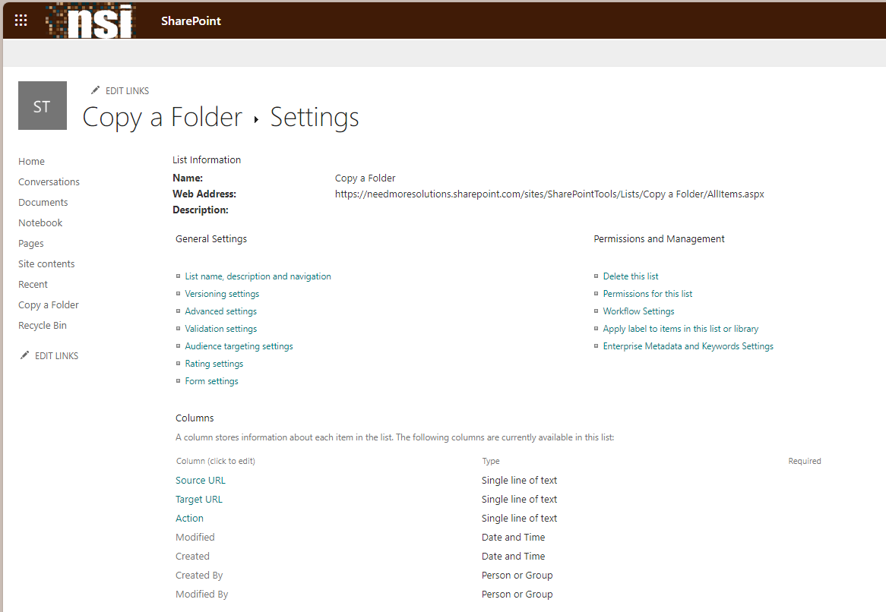
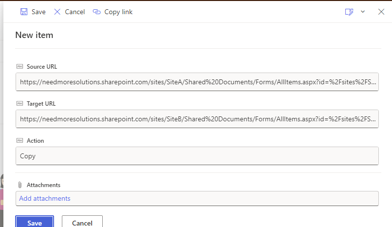
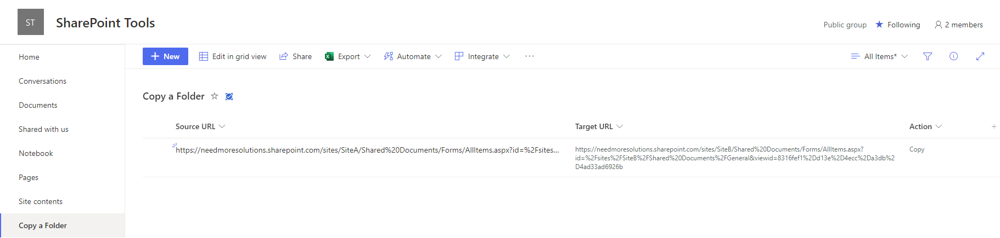

# M365Tools
This repo is for any useful tools and scripts for Microsoft 365 that I build or enhance from other projects. 

## PowerShell Cmdlets: 
[Copy-SPOFolder](https://github.com/erobillard/M365Tools/blob/main/docs/Copy-SPOFolder.md)

Minimal path to awesome: 
   - Open Powershell and run Copy-SPOFolder with source and target parameters. 

Path to alternative awesome:
1. Create and configure a SharePoint List: 
   - Create a SharePoint List with the Blank List template named "Copy a Folder" 
   - Open List Settings and rename the Title column to SourceUrl.
   - Create a Single line of text column named TargetUrl. Rename this column after creation if you prefer a different display name. 
   - Create a Text column called Action. Set the column's default value to Copy
2. If you chose different column names or labels in Step 1, locate the section "# Define variables" below and update the values as needed.
3. Add a few rows with valid source and target values for testing. Note that the target library or subfolder must exist, create as needed.
4. Install PnP PowerShell
5. Execute the script, e.g.:  Copy-SPOFolder -verbose -siteUrl "https://contoso.sharepoint.com/sites/SharePointTools" 

Step 1:

Step 3: 

Step 5:

